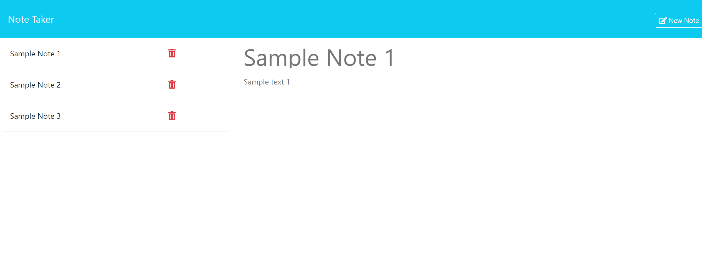

# note-taker

## Project Description

A study in refactoring a note taking app to utilize Express and JSON database storage.

## Contents

- [Introduction](#introduction)
- [Problem](#problem)
- [Solution](#solution)
- [Deployment](#deployment)
- [Collaborators](#collaborators)
- [Resources](#resources)
- [License](#License)

## Introduction

For this project I was given an existing codebase to refactor so that the project may utilize Express routing and JSON database storage, enabling users to enter new notes into a list which is saved to a flat file database for access on reloading the page. The client stated that optionally, functionality for the delete buttons already present could be added if desired, which I have accomplished.

## Problem

I was given the code for this project in the following state:

- Code had all public assets, front-end functionality and UI design completed.
- Code lacked Express server functionality for route handling.
- Code lacked a database in which to store a user's saved notes or retrieve them.

## Solution

I rectified the above problems in the following way:

- I added a server.js file into the project root and configured Express.
- I added a db.json file into the db folder and configured the default JSON.
- I developed the necessary GET, POST, and DELETE routes required to provide functionality to the frontend.

See below for a screenshot of the project:

## Deployment

[Link to the GitHub repo for this project](https://github.com/Aoliva96/note-taker)

[Link to the deployed project on GitPages](https://aoliva96.github.io/note-taker)

## Collaborators

I received useful advice from my bootcamp instructor John Young regarding Express and how server.js should be configured to properly handle the routes defined in the provided code.

## Resources

See the links below to see some of the resources I used for this project:

[NodeJS | File System Module](https://www.w3schools.com/nodejs/nodejs_filesystem.asp)

[NPM | uuid](https://www.npmjs.com/package/uuid)

[Express | Basic Routing](https://expressjs.com/en/starter/basic-routing.html)

I also referenced code from the week 11 in-class activity 20, Data Persistence, to achieve the proper Express structure.

## License

This project utilizes the standard MIT License.
